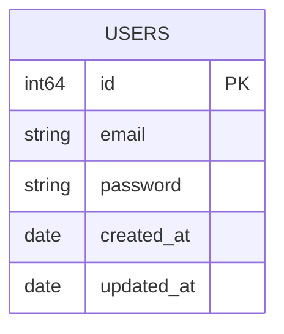

# Program Autentikasi

Aplikasi Backend Autentikasi menggunakan Gin-Gonic sebagai frameworknya.

### Tech Stack:
- GO v1.25.4
- github.com/bildanjhry/go_shared-lib v1.0.1
-	github.com/gin-gonic/gin v1.12.0
- github.com/jackc/pgx/v5 v5.10.0

### ERD:

