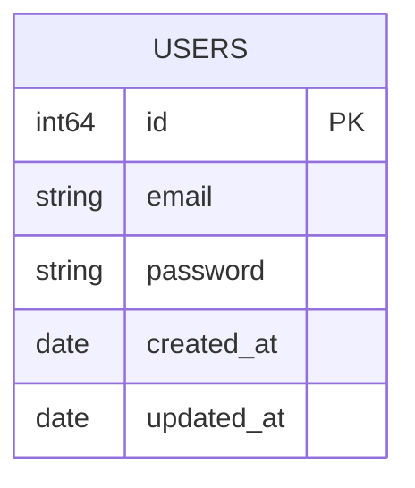

# Program Autentikasi

Aplikasi Fullstack dengan Backend menggunakan Gin-Gonic sebagai frameworknya, HTML & CSS dan Jquery untuk Frontendnya serta untuk engine autentikasi aplikasi ini menggunakan JWT.

### Tech Stack:
- Go v1.25.4
- github.com/bildanjhry/go_shared-lib v1.0.1
- github.com/gin-gonic/gin v1.12.0
- github.com/jackc/pgx/v5 v5.10.0
- github.com/golang-jwt/jwt/v5 v5.3.1
- github.com/swaggo/files v1.0.1
- github.com/swaggo/gin-swagger v1.6.1
- github.com/swaggo/swag v1.16.6

### ERD:

Sedangkan untuk dokumentasi API, aplikasi ini menggunakan swaggo (swagger-go)
### Preview:

