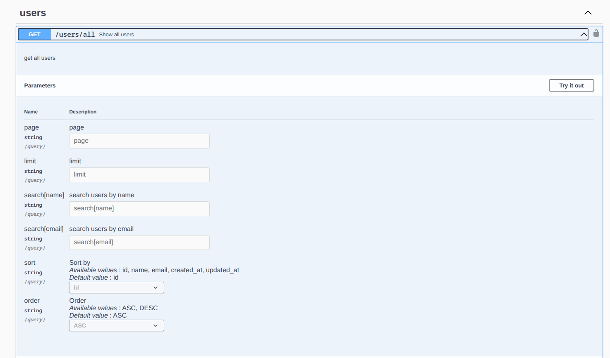
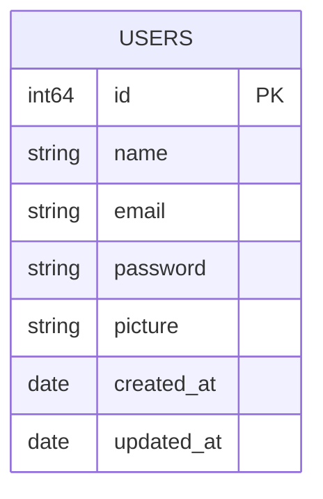
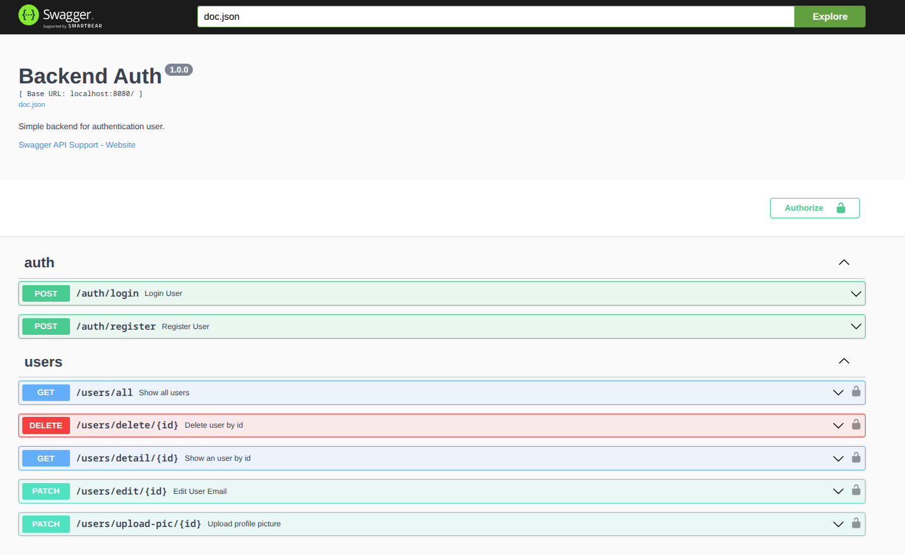

# Program Autentikasi


Aplikasi Fullstack dengan Backend menggunakan Gin-Gonic sebagai frameworknya, HTML & CSS dan Jquery untuk Frontend-nya serta Jason Web Token(JWT) untuk engine autentikasi-nya.

### Features:
- Pagination
- Limit data result
- Search by name
- Seacrh by email
- Sorting options [id, name, email, created_at, updated_at]
- Order options ASC/DESC


### Response in Json:
```json
{
  "Success": true,
  "Status": 200,
  "Message": "Success Get All Users",
  "Page": "1",
  "ORDER_BY": "id",
  "Order": "ASC",
  "Data_length": "3",
  "Results": [
    {
      "id": 36,
      "name": null,
      "email": "test@mail.com",
      "created_at": "2026-07-20T14:06:33.993472Z",
      "updated_at": "2026-07-22T14:26:31.304276Z",
      "picture": "uploads/user-picture-36.webp"
    },
    {
      "id": 40,
      "name": null,
      "email": "devide@mail.com",
      "created_at": "2026-07-20T14:06:37.080999Z",
      "updated_at": "2026-07-22T14:19:17.551774Z",
      "picture": "uploads/user-picture-40.png"
    },
    {
      "id": 61,
      "name": null,
      "email": "jarum@mail.com",
      "created_at": "2026-07-20T15:21:13.219953Z",
      "updated_at": "2026-07-22T13:50:04.533697Z",
      "picture": "uploads/user-picture-61.webp"
    }
  ]
}
```

### Tech Stack:
- Go v1.25.4
- github.com/bildanjhry/go_shared-lib v1.0.1
- github.com/gin-gonic/gin v1.12.0
- github.com/jackc/pgx/v5 v5.10.0
- github.com/golang-jwt/jwt/v5 v5.3.1
- github.com/swaggo/files v1.0.1
- github.com/swaggo/gin-swagger v1.6.1
- github.com/swaggo/swag v1.16.6


### ERD:



Untuk dokumentasi API, aplikasi ini menggunakan swaggo (swagger-go) dan berikut merupakan endpoint-endpoint dari program ini
### Preview:

